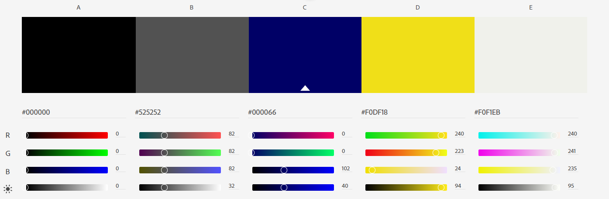
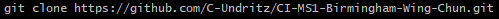

# Birmingham Wing Chun Website - Readme document

># **Overview**
The Birmingham Wing Chun clubs have been operating since 1982 and in that time has seen the club profile increase with the opening of more clubs round the West Midlands.  At the same time competition has increased with four dedicated Wing Chun organisations opening clubs in the area.  

Student numbers continue to grow, however questioning these students it has been revealed that the interest in the club was not mainly driven via the website, but mainly through social media platforms and word of mouth.  This is reflected in the website stats.  

The existing website is old and does not reflect modern website design ethos in terms of layout and responsive design across devices.  It has therefore been determined that the clubs online profile is in need of an update with this new and modern website that is focused on getting more potential students in through the door and training.

># **Strategy**
The strategy behind the website is to deliver key information through a streamlined experience where the potential student feels informed and will the opportunity to question further at club locations or via an interactive contact form hosted on the website.  The website is not designed to be an extensive and detailed resource about the club and Wing Chun.  

---
# Organisation Goals
* Increase the profile of the club in the face of increased competition
* Have a slick modern online presence which can be controlled
* Inform and attract potential students.

---
# Organisation Stories
* *I want a consistent styling throughout the website using the clubs primary colours of yellow and blue.*
* *I want easy and current navigation links so that users do not get frustrated trying to find information and end up leaving the site.*
* *I want to be able to present information about Wing Chun so that prospective students have a good idea what Wing Chun is prior to attending the club.*
* *I want to be able to present information about the club so that prospective students can get a feel for the type of club we are.*
* *I want all financial, club locations and financial information presented to prospective students.*
* *I want prospective students to be able to contact us easily through the website and social media.*

---
# User Stories
* *I want to be able to have a good user experience on a mobile or tablet as I do not have access to a desktop PC or laptop out of the workplace.*
* *I want to be able to easily navigate the site on any platform.*
* *I want to know what Wing Chun is.*
* *I want to get an idea about what it would be like to train at West Midlands Wing Chun Kuen.*
* *I want to know the location(s) of the Wing Chun club where I can train.*
* *I want to know what the training schedule at each club so I can determine if the club is an option for me.*
* *I want to know, as a new student, what is the cost of training and are there any payment options.*
* *I want to know if I need insurance to train and if so, how much will it be?*
* *I want to be able to contact the club to ask any questions that I may have about a specific club location if required.*
* *It would be good to be able to easily check out the clubs presence on social media to give me a further idea as to who trains there.*

># **Scope**
# Content
The information presented in the site has been purposefully kept minimal and focused to keep the user attention so as to reduce the risk of overloading the user; potentially driving them away to another club/martial art.  

## The content has therefore been designed to keep the user attention by:
1.	Providing enough information so an informed choice can be made.
2.	Ensuring that the experience across a number of devices is satisfying.

## The information presented is concerned with:
1.	Being the first place the users will land if searching online for Wing Chun in the West Midlands
2.	Engaging users with an impactful landing page promoting the club
3.	Informing the users about the club, where to train and costs
4.	Informing the users about Wing Chun and its history

## Functional Requirements.
1.	Responsive design; assumption is that most users will browse through to the site from a mobile or tablet, therefore Bootstrap grid was used to ensure that the website is responsive.
2.	Permanent top Nav bar on every page to aid navigation.
3.	Link to home page/landing page from logo positioned left in the Nav bar
4.	A clear and intuitive contact form for further questions to be asked
5.	Clear and obvious links to the clubs presence on social media platforms
6.	Feedback animations to provide user with clear interaction cues for buttons, media boxes and links

># Structure
The website consists of five pages:
1. Home/landing page
2. About Us
3. Classes
4. Contact Us
5. Gallery

---
# Navigation
Navigation between and within the five pages will be facilitated by:
1. Navigation Bar fixed at the top of each page and always displayed when the user scrolls down.
2. Call to action button on the landing page that will take the user straight to the 'Contact Us' page.
2. Three images presented as links towards the bottom of the home page that will link to three pages: 'About us', 'Classes' and 'Contact Us'.

This is in line with current website design and UX trends.

---
# Consistent Features between pages
Each page has a responsive fixed Navigation bar with five links justified to the right to link to each of the five pages.  A logo is present in the top left that links to the home page.  A footer is present on every page with social media icons linking to the Facebook, twitter, Instagram and YouTube.

Each page features an appropriate banner image with text, apart from the home page that has a hero image filling more of the screen so as to present an impactful first impression of the site and so encourage the user to explore further.

># **Skeleton**
# Wireframes
Current version(v0.3):
* [Mobile](assets/readme/LearnWingChun_mb_wireframes_v0.3.pdf)
* [Desktop](assets/readme/LearnWingChun_dk_wireframes_v0.3.pdf)

Archive Wireframes - original design(v0.2).  
The design in these wireframes was changed following initial user testing.  The changes are 
detailed in the section 'Noted design changes' later in this document.
* [Mobile(v0.2)](assets/readme/LearnWingChun_mb_wireframes_v0.2.pdf)
* [Desktop(v0.2)](assets/readme/LearnWingChun_dk_wireframes_v0.2.pdf)

---
# Home/landing page
To have the most impact, the home screen features a larger banner with text leaving the user in no doubt as to what is offered by the organisation.  On tablet and mobile the banner is muted so that the text remains clear.  There is a call to action button, which prompts the user to ‘Contact Us’.  Selecting this mavigates to the 'contact us' page.

The second section is for promotion of Wing Chun and the club; bullets points detailing benefits and testimonials.  It was required here to have an image of a woman training so as to point out that this is a martial art for women as well.  

The third section is presented as three images with overlay text and an appropriate icon indicating to users that these are navigation links to the 'About Us', Classes' and 'Gallery' pages.  User feedback animation have been applied consistently across the three boxes for hover for the desktop experience. 

---
# About Us
The About Us page hosts three sections topped with an appropriate banner:
* What is Wing Chun?
* History of Wing Chun
* About the Club

---
# Classes
The Classes page hosts three sections topped with an appropriate banner:
* Training Locations
* Prices
* What to Expect.

---
# Contact Us
The contact page features a contact form which requests:
* Users name
* Users email address
* Details of their query

These are all required input for the query to be sent

It also features a radio button where the user can detail which club their query is about.  It is not required that the user use these as there query may be a general query.  It is planned that the query can be directed to a specific person within the club depending on the radio button selected.

The form finishes with a ‘Submit’ button.

---
# Gallery
The gallery images are presented as a page of images that resize to fit the screen size for various devices and fulfil the requirement for responsive UX.

Each images can however be selected which then opens a fancy box window to view the image and then to move onto the next image, the previous one or return to the gallery page in the background.

># Surface

# Colours
The club colours are blue (#000066) and yellow (#F0DF18) and so I wanted to incorporate these throughout the site to break up the sections.  The text throughout the site is the grey (#525252) when on a pale background and the off-white (#F0F1EB) when on a dark background.

Palette:

---
# Fonts
Fonts chosen:
* For the headings: [Roboto Slab](https://fonts.google.com/specimen/Roboto+Slab?query=Roboto)
* For the paragraphs: [Roboto](https://fonts.google.com/specimen/Roboto)

---
# Technologies used
* HTML5
* CSS3
* JavaScript (no coding completed but this was required by Bootstrap and FancyBox)
* Bootstrap
* Gitpod
* GitHub
* GoogleFonts
* Fontawesome
* Balsamiq
* Fancybox (http://fancyapps.com/fancybox/3/): Used for the gallery.
* Canva (https://www.canva.com/): Used as a quick and easy way to crop images to pixel specific dimensions
* Microsoft PowerPoint: used to create a transparent background for images for the browser tab and Chinese symbols on homepage banner.

Bootstrap technology used:
* Container
* Grid
* Buttons
* Card
* Carousel
* Modal
* Navbar
* Flex
* Spacing

---
># Testing
Testing to be completed is detailed in the [TESTING.md](TESTING.md) document

># Noted design changes
* User testing was done on the website in a 70% completed stated with all of the main navigation elements in place including the 'discovery' section at the bottom of the index (home) page, which the user was encouraged to access via the 'learn more' button on the landing page.  It was found that the users liked the experience of the 'discovery' section and therefore wanted to get back to it to continue navigating from there.  However as they had used the 'learn more' button to access the 'discovery' area, they did not know that it was at the bottom of the home page and so they quickly got lost.  They were further confused when they then used the top nav menu to access the pages directly to then discover that they had already seen the content by using the 'Discovery' section.  This lead to an overall bad user experience navigating the site.  This was remedied by changing the navigation elements at the bottom of the home page to three links to the ‘about us’, ‘classes’ and ‘gallery’ pages which can be seen in the updated [wireframes](#wireframes).  This mirrored the navigation of the top navigation bar and offered a better UX with multiple ways to navigate the site depending on the user habits and expectations.

* The above lead to a further removal of the links to the three sections on the ‘about us’ and ‘classes’ pages as it was determined that these did not add to the user experience.  The user tended to use them once (if at all) however as they had to scroll up to get back to them they were not used again and they chose to scroll instead of using these links.

* Change in the way the club locations and schedules displayed.  The wireframes show against each club location a 'GoogleMap' and then the address of the club to the right/left.  The final implementation was completed with Bootstrap 'cards' which allowed an image of the club to be shown which would be helpful to students.  The GoogleMap was then linked from a button within the card.  It was thought that also adding the club training times here would make for a better user experience, however in order to avoid extending the height of the cards further, an additional button was added which causes a 'modal' to display with the club training times. 

* An issue was experienced with the design of the contact us page and the display of the form over the banner.  Please see the Problems and fixes section in the TESTING.md document for details.  This issue along with the need for this page to look more like the other pages lead to the design change to move the form to a position on the page that was below the banner.  This change was more in keeping with the presentation across the site and solved the issue.

* In the second section of the Homepage on all devices and resolutions the benefits have been displayed before the image.  This is so there is some text shown before another image, so the flow of the page from top to bottom alternates between images and text.  In the wireframes the images was shown before the benefits.

* Change in the colour blue used.  The orginal chosen blue colour (#195ACC) when applied to the website elements (navigation bar, footer and section headings) looked too light *in situ*.  Therefore it was changed to the clubs original blue colour (#000066), which while dark in large areas, was thought to be well suited to the mentioned website elements. 

># Development & Deployment
* A repository was setup in GitHub using the Code Institute Gitpod [full template]( https://github.com/Code-Institute-Org/gitpod-full-template).
* All development was completed using Gitpod and code was regularly pushed back to the GitHub repository.
---
# Website deployment.
The following steps were taken in GitHub to deploy the site and can be replicated:
1.	Login to GitHub
2.	From the list of repositories select the desired repository
3.	From the list of nine options underneath the repository name; select ‘Settings’
4.	Scroll down to the section titled ‘GitHub Pages’
5.	In that section, under ‘source’, click the drop down menu and select the ‘master’ branch
6.	In the drop down menu next to that select ‘root’
7.	Click save
8.	A message is displayed in this section stating that the site is published and the address of the site. Click this to view the site

Note that it can sometimes take up to 20 minutes for the site to publish so be patient.  Please see [here](https://docs.github.com/en/free-pro-team@latest/github/working-with-github-pages/configuring-a-publishing-source-for-your-github-pages-site#choosing-a-publishing-source) for the GitHub Docs page on this process.

---
# Running the project locally.
To work on the project code locally a clone can be taken by following the steps below or downloading the files as a zip file.  To see the options open the desired repository and select the drop down menu button ‘Code’ (found under the repo name and above the list of files)

## Clone:
To do this you will need [GitBash for Windows](https://gitforwindows.org/) installed (for other OS versions see https://git-scm.com/downloads).
1. Open GitBash
2. Change the current working directory is required.  On windows, by default, the files will be downloaded to the users file directory on the C:drive
3. In the ‘Code’ dropdown menu select either HTTPS or SSH and copy the link.
4. In the GitBash window type ‘git clone’ and then paste the copied link:

5. Hit Enter and the files will then be cloned to be worked on locally.

Please see [here](https://docs.github.com/en/free-pro-team@latest/github/creating-cloning-and-archiving-repositories/cloning-a-repository) for the GitHub Docs page on this process.

># Credits
# Code
1. Fancy Box was used to enable functionality provided in the gallery page.  The instructions and code for using this can be found at http://fancyapps.com/fancybox/3/.  Implementation of this worked well at desktop and tablet resolutions, however there were issues at mobile resolutions with the display of thumbnails and the viewing of images.  The implementation of this functionality by Anna Greaves in her website [Portrait Artist](https://github.com/AJGreaves/portrait-artist/blob/master/README.md) helped me work through these issues.
2. Simple one, but I had to look it up: [how to hide an image for responsive design](https://www.thesitewizard.com/css/hide-images-on-mobile-website.shtml)
3. [How to insert a space in text](https://www.wikihow.com/Insert-Spaces-in-HTML)
4. CSS Image styling for some responsive design: [w3schools CSS Styling Images](https://www.w3schools.com/css/css3_images.asp) 
---
# Images and Content
## Images:
* Image of Bruce Lee for About Us page banner (bruce-lee-statue.png) was gratefully offered free for commercial use from Pixabay with no attribution required: https://pixabay.com/photos/bruce-lee-hong-kong-2164515/
* Image 'Grandmaster Ip Man and his son Ip Chun circa 1950' (ipman-ipchun-1950s.png) sourced from http://www.kwokwingchun.com/about-wing-chun/ip-mans-wing-chun/ip-mans-biography/
* Image '19th century picture of wooden dummy training at the Red Junk Opera company' (red-junk-opera-wooden-dummy.png) sourced from https://barcelonawingchun.com/en/what-is-wing-chun/wing-chun-history/
* Image 'Grandmaster Ip Man circa 1950' (ip-man-wall.png) sourced from https://chinesemartialstudies.com/2019/09/29/the-history-and-global-transmission-of-wing-chun-in-less-than-five-thousand-words/
* Image 'A young Bruce Lee training on the wooden dummy' (bruce-lee-wooden-dummy.png) sourced from https://www.pinterest.co.uk/pin/423127327464869905/

All other images were were used with permission from Sifu Shaun Rawcliffe and were sources from the following links, or sent to me directly by Sifu Shaun Rawcliffe.
* http://www.wingchun.co.uk/sifusphotos.htm
* http://www.wingchun.co.uk/classphotos.htm
* http://www.wingchun.co.uk/mwckhkgallery.htm
* http://www.wingchun.co.uk/seminars.htm
* https://www.facebook.com/MidlandsWingChunKuen

## Content:
All content was informed and adapted from the following websites:
* http://www.wingchun.co.uk/wingchun.htm
* https://www.wingchunconcepts.com/about.php
* https://www.wingchunconcepts.com/historyofwingchun.php

---
# Help
* Anna Greaves for the code for enabling FancyBox to work at Mobile resolutions.
* Thanks to members of the Slack community for their support and help, particularly Mr_Bim_alumni, JimLynx_lead and Daisy Mc Girr.
* Thanks in particular to Mr_Bim_alumni for his help trying to fix the image issue on the Apple iPad.

