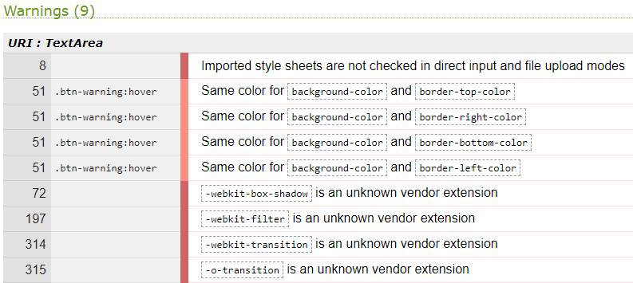
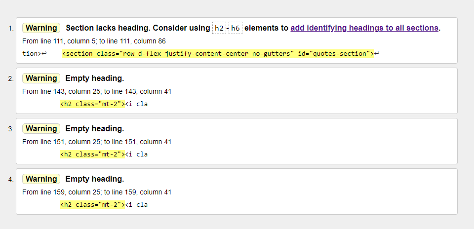
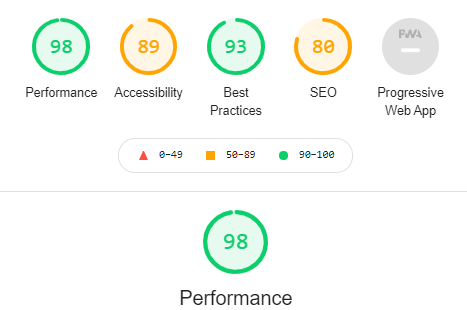

# **Birmingham Wing Chun Website - Testing document**

[Readme document](README.md)

---

# **Quality checks:**
>## Approach
### **CSS style sheet:**
* [Autoprefixer](https://autoprefixer.github.io/)
* [W3C CSS validation](https://jigsaw.w3.org/css-validator/)
### **HTML:**
* [W3C Markup Validation](https://validator.w3.org/)
### **Website performance:**
* Google Chrome Lighthouse.
* Opera Lighthouse.

>## Results.
### **W3C CSS Validation:**

* Errors: None reported.
* Warnings: 9 reported and no action taken as these css styles are required:

### **W3C Markup Validation:**
Tested each page by validation of the URL's:

* about.html: No errors or warnings to show.
* classes.html: No errors or warnings to show.
* contact.html: No errors or warnings to show.
* gallery.html: No errors or warnings to show.
* index.html: 4 warnings reported and no action taken.

### **Website Performance:**
Google Lighthouse score prior to code check and validation, and testing (responsive and user):

The following activities were then completed:

* Peer and Mentor review along with relevant fixes and changes from feedback
* Code check and clean up (checking correct layout, all alts present, any unused classes or id's, efficiency of css style sheet)
* CSS and HTML validation
* Manual testing of functionality on all pages (as per the section below)
* Responsive Design testing (as per the section below) 

Subsequent website performance checks:

Google Lighthouse:

Opera Lighthouse:

Microsoft Edge Lighthouse:

Firefox Lighthouse:

---
# Responsive Design testing:
Tested responsiveness of each page using the following methods:
* Google Chrome DevTools
* Viewed the live site on the following devices:
    * Huawei P smart 2019 
    * Laptop at 1920 x 1080 resolution (scaled at 100%, 125% and 150%)
---
# Manual testing of functionality on all pages.
The following testing completed at resolutions: ?

## All Pages
### Navigation bar:
* Fixed at top upon user scrolling
* Right hand organisation logo returns to home page from all pages 
* Right hand organisation logo returns to top of home page when selected from anywhere on the home page
* Each link on the right is underlined when on the page that reflects that link is being viewed
* ‘Home’ link returns user to the top on the ‘Home’ page when viewing the ‘Home’ page.
* Link to ‘Home’ works from ‘About Us’, ‘Classes’, ‘Contact Us’ and ‘Gallery’ pages.
* ‘About Us’ link returns user to the top on the ‘About Us’ page when viewing the ‘About Us’ page.
* Link to ‘About Us’ works from ‘Home’, ‘Classes’, ‘Contact Us’ and ‘Gallery’ pages.
* ‘Classes’ link returns user to the top on the ‘Classes’ page when viewing the ‘Classes’ page.
* Link to ‘Classes’ works from ‘Home’, ‘About Us’, ‘Contact Us’ and ‘Gallery’ pages.
* ‘Contact Us’ link returns user to the top on the ‘Contact Us’ page when viewing the ‘Contact Us’ page.
* Link to ‘Contact Us’ works from ‘Home’, ‘About Us’, ‘Classes’ and ‘Gallery’ pages.

#### Desktop only:
* Each link on the right is underlined when the user hovers over the link as part of UX feedback.

#### Mobile only:
* Nav bar links become compressed into ‘burger’ icon which when selected contains all of the navigation options
* Logo still displays on the left

### Footer:
* Only shown when the user reaches the bottom of the page/
* Link to ‘Contact Us’ page only shown on ‘Home’, ‘About Us’, ‘Classes’ and ‘Gallery’ pages.
* Link to ‘Contact Us’ works from ‘Home’, ‘About Us’, ‘Classes’ and ‘Gallery’ pages.
* Link to Facebook page from Facebook icon works as expected from ‘Home’, ‘About Us’, ‘Classes’, ‘Contact Us’ and ‘Gallery’ pages.
* Link to Instagram page from Instagram icon works as expected from ‘Home’, ‘About Us’, ‘Classes’, ‘Contact Us’ and ‘Gallery’ pages.
* Link to YouTube page from YouTube icon works as expected from ‘Home’, ‘About Us’, ‘Classes’, ‘Contact Us’ and ‘Gallery’ pages.
* Link to Twitter page from Twitter icon works as expected from ‘Home’, ‘About Us’, ‘Classes’, ‘Contact Us’ and ‘Gallery’ pages.

#### Desktop only:
* Each social media link gets bigger when the user hovers over the icon as part of UX feedback.

## Homepage – 1st section *'landing page'*
* Hero image takes up the whole of the available browser space with image of Sifu on the right.
* ‘Learn Wing Chun’ is displayed in white on two lines and set to the left
* Birmingham Wing Chun Kuen is displayed below on one line and set to the left.
* A line in white is displayed to separate the text.
* Call to action button displayed below all text in the center and when selected takes the user further down the homepage to the ‘discovery’ section.

#### Desktop only:
* The club logo is displayed after the ‘Learn Wing Chun’ text.
* Call to Acton button feedback animation occurs when user hovers over it.

#### Mobile only:
* The hero image is ‘tinted’ and Sifu is moved right to display underneath the text.
* The club logo does not appear.

## Homepage – 2nd section *'Benefits and Testimonials'*
* Section does not take up full screen length but does take up all of the width.  
* Image displays

#### Desktop only:
* Image displays on the left
* Four Benefits display on the right
* Two Testimonial’s display below the benefits on the right

#### Mobile only:
* Image displays first at top
* Four Benefits display sequentially top to bottom
* Two Testimonials display sequentially top to bottom

## Homepage – 3rd section *'Discovery'* 
* Six boxes displayed which link to six sections on the web site.
* Background image displayed.
* ‘What is Wing Chun’, ‘History of Wing Chun’ and ‘ The Club’  link to the relevant sections on the ‘About Us’ page.
* ‘Training Locations’, ‘Schedule & Prices’ and ‘What to Expect’ link to the relevant sections on the ‘Classes’ page.

#### Desktop only:
* Each link box grows slightly larger and the image changes and becomes opaque when the user hovers over as part of UX feedback.

#### Mobile only:
* Each link box will permanently display the image that is part of the UX feedback for the desktop display.

## Classes page:
* Banner image shown that takes full screen width but not full screen height.
* Three boxes displayed which link the user to the sections on this page: ‘Training Locations’, ‘Schedule & Prices’ and ‘What to Expect’
* Content for each section is relevant, consistent, free of spelling and grammatical errors and contains relevant images.

#### Desktop only:
* Each link box grows slightly larger and the image changes and becomes opaque when the user hovers over as part of UX feedback.

#### Mobile only:
* Each link box will permanently display the image that is part of the UX feedback for the desktop display.

## About Us page:
* Banner image shown that takes full screen width but not full screen height.
* Three boxes displayed which link the user to the sections on this page: ‘What is Wing Chun’, ‘History of Wing Chun’ and ‘ The Club’  
* Content for each section is relevant, consistent, free of spelling and grammatical errors and contains relevant images.

#### Desktop only:
* Each link box grows slightly larger and the image changes and becomes opaque when the user hovers over as part of UX feedback.

#### Mobile only:
* Each link box will permanently display the image that is part of the UX feedback for the desktop display.

## Contact Us page.
* Banner image takes up full screen display.
* Form displays over the image in translucent background.
* ‘Name’, ‘Email’ and ‘Question’ fields present with user hint in each.
* Radio button selectors present for three club locations.
* Submit button present at the bottom of the form.
* All field to be filled in to allow submission of form.  Error message will display if field empty upon submission.

#### Desktop only.
* Submit button feedback animation occurs when user hovers over it.

## Gallery page.
* All images display in four columns resizing to fit all in with vertical scroll bar appearing if required.
* Upon user selecting image, image will appear in fancy box with nav items to select left and right for a slide show through the images.  ‘x’ in top right to allow user to close fancy box and view image gallery.
---

# User Stories Testing.
1. I want to be able to have a good user experience on a mobile or tablet as I do not have access to a desktop PC or laptop out of the workplace.
    * *Responsive design is employed across all pages primarily using bootstrap grid to deliver a satisfying UX on mobile, tablet, laptop and large desktop PC displays.*
2. I want to be able to easily navigate the site on any device
	* *The Nav bar is displayed at the top of the site on any platform on each page.*
    * *The logo (in the top left) of the nav bar is displayed on each page and links to the landing page.*
	* *There is a call to action button on the hero image that takes the user to the ‘discovery’ section.*
3. I want to know what Wing Chun is
	* *The ‘About Us’ page has sections that describe ‘What Wing Chun is’ and the ‘History of Wing Chun’*
	* *The user can navigate to these from the ‘About Us’ link in the top nav menu on each page.  This takes the user to the ‘About Us’ page where there are media boxes that link to relevant sections further down in the page, or the user can scroll down to the required section.*
    * *The user can navigate directly to sections of the website sections that describe ‘What Wing Chun is’ and the ‘History of Wing Chun’ from the landing page ‘discovery’ section which is accessed by scrolling down or from the call to action button.  Here there will be two media boxes which will link to these sections.*
4. I want to get an idea about what it would be like to train at West Midlands Wing Chun Kuen
    * *The ‘About Us’ page has a section 'The Club' that informs the user about the club.*
	* *The ‘Classes’ page has a section that details ‘What to expect’ when training at the club.*
	* *The ‘What to expect’ section can be accessed from the 'Classes' link in the nav menu or the media box in the discovery section of the landing page.*
	* *There is a gallery page that features pictures of students training at the club.*
5. I want to know the location(s) of the Wing Chun club where I can train.
    * *The ‘Classes’ page has a section that details the locations of each club where the student can train.  This includes a postal address and a map. The classes page can be accessed from the nav menu.*
    * *The club locations section on the 'Classes’ page can be accessed from the media box link in the discovery section on the landing page.*
6. I want to know what the training schedule at each club so I can determine if the club is an option for me.*
    * *The ‘Classes’ page has a ‘Schedule & Prices’ section that details the schedule of weekly training across all clubs.*
    * *The ‘schedule & prices’ section on the 'Classes’ page can be accessed from the media box link in the discovery section on the landing page.*
7. I want to know, as a new student, what is the cost of training and are there any payment options
    * *The ‘Classes’ page has a ‘Schedule & Prices’ section that details the cost of classes and payment options across all clubs.*
    * *The ‘Schedule & Prices’ section on the 'Classes’ page can be accessed from the media box link in the discovery section on the landing page.*
8. I want to know if I need insurance to train and if so, how much will it be?
    * *The ‘Classes’ page has a ‘Schedule & Prices’ section that details the insurance required and the cost.*
9. I want to be able to contact the club to ask any questions that I may have about a specific club location if required.
    * *From the nav bar on each page there is a link ‘Contact Us’ that takes the user to a new page which has a form that the user can fill in and submit with a query.*
    * *The form has radio buttons so that the user, if they choose, can make the query specifically about a club location.*
    * *There is a Contact Us link at the bottom of every page (apart from the contact us page) to ensure that the website is in line with current trends and user expectations.*
10. It would be good to be able to easily check out the clubs presence on social media to give me a further idea as to who trains there 
    * *There are links at the bottom of every page to the clubs presence on social media sites Facebook, twitter, Instagram and YouTube.*
---
# Problems and fixes
1. Footer responsive design problem.  The wireframe designs showed that the 'contact us' link was required to appear on the left and  the social links on the right (in the desktop view) whilst on the mobile view they were required to stack with the ‘contact us' link appearing below the social links.  Originally the 'contact us' content appeared first in the html and then the social links *ul* list and using the bootstrap Grid classes ‘mr-auto’ and ‘col-auto’ to display them far left and right.  However in the mobile view it then displayed the ‘contact us’ link on top of the social media icons contrary to the wireframe and the assumed user flow.  
* *Fixed by: Rearranging the html by coding the ‘contact us’ link after the social links *ul* list and then gave the ‘contact us’ section a Bootstrap Grid class of ‘order-md-1’ and the social media icons the class of ‘order-md-2’.*
* *18/12/2020 - Update: following a review with my mentor it was questioned whether the contact us should be in the footer when it is in the navbar and presented as a button on the landing page.  Therefore it was removed and replaced with a copyright statement, so the above still applies to the positioning of the social links and the copyright statement.*
2. Fancy Box experience on mobile not working correctly on mobile devices.  The implementation of FancyBox worked fine on desktop and tablet resolutions, but on mobile the Fancy box controls did not display as the image was bigger than the screen.  
* *Anna Greaves also implemented FancyBox on her website 'Portrait Artist' and so I tested that and saw that it worked correctly at mobile resolutions.  looking at the code, Anna did two things. 1) each image was placed within a BS Grid row and column with breakpoints so that the display of images was clear on the webpage.  2) a class was added to each image which styled them as 'width: 100%'.  Fixed by implementing the two points raised above: each image contained within row/col and styled each image as 100% width - thanks to Anna!*
3. On the home page callout section it was found that the image of Sifu obscured the text on smaller devices so an overlay was used to darken the image on smaller devices.  However this caused the text and button to be covered by the overlay and which meant that as well as the text darkening, the button could not be interacted with.  
* *After searching the internet and, in the end, thinking of trying a diffrent approach, the solution was provided on Slack by 'Mr_Bim_alumni' who stated that the row needed to be styled 'position: relative' which allowed the z-index to take effect so that it no longer sat above the text and button.*
4. On the index page, after it was styled, it was found that the 'quotes' section was a few pixels wider than all of the other features on the page and so a scroll bar appeared at the bottom of the page.  None of the other pages had this issue.
* *The cause of this was not obvious, however fellow student 'Daisy Mc Girr' recognised this issue and recommended a few fixes to try.  Worked through a few of these and the one that worked was to add the Bootstrap Grid class 'no-gutters' to the same line as the Bootstrap 'row' class for this section.  This fixed the issue.*
5. On the contact us page, when viewing on the mobile and selecting to enter text into the form, the screen keyboard was pushing the footer up to over lap with the form with the form appearing over the footer.
* *A fix was not found for this.  It was recommended to me by my Mentor that I use the Bootstrap class 'fixed-footer', however this did not fix the issue and just resulted in the footer appearing over the form.  A design change occured to bring the this page more in line with the design across the site in that the form was placed below the banner, not displaying over it as per the original wireframes.  This also fixed this issue and the footer and the form no longer display over each other.* 
6. The banner height was too big on mobile screens and so needed to make the banner images more responsive.  Making the banners shorter meant that less of the images were seen and so needed to 'zoom out' so that more of the image was shown even with a smaller banner 'window'.
* *Achieved this by using the 'background-size' attribute to scale the image size for each banner at media query <376px*

