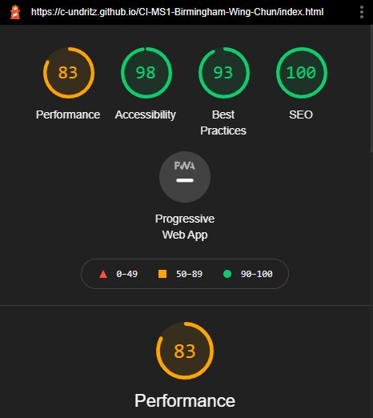
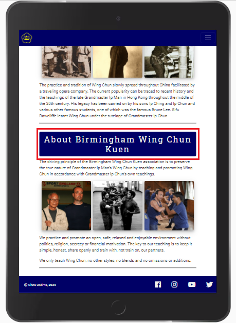
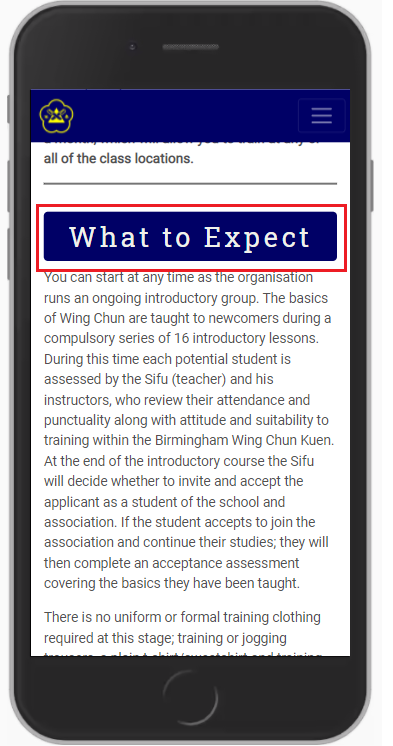

# **Birmingham Wing Chun Website - Testing document**

[Associated Readme document](README.md)

---
># **RESPONSIVE DESIGN TESTING**

Tested responsiveness of the features on each page using the following methods:
* Google Chrome DevTools at resolutions:
    * 1600 x 992
    * 1280 x 802
    * 768 x 1024 (iPad)
    * 414 x 736 (iPhone 6/7/8 plus)
    * 411 x 731 (Pixel 2)
    * 411 x 823 (Pixel 2 XL)
    * 375 x 812 (iPhone X)
    * 375 x 667 (iPhone 6/7/8)
    * 320 x 568 (iPhone 5)
    * 320 x 480

The test sheet and results can be viewed from this link:
[Responsive Test results](assets/readme/ms1-responsive-tests.pdf)

* Also tested the live site on the following devices:
    * Huawei P smart 2019 
    * Laptop at 1920 x 1080 resolution (scaled at 100%, 125% and 150%)
    * Apple iPad 7th Generation (iOS v 14.2)
    * Amazon Fire HD 8 tablet
    * Apple iPhone 5 and iPhone 8

The only device on which problems were experienced was on the Apple iPhones and iPads.  The problems experienced are described in items 7 and 8 in the 'Problems and Fixes' section later in this document. 

---
># **FUNCTIONALITY TESTING**
The following testing completed at resolutions using Google Chrome Devtools: 
* 1920 x 1080 (desktop)
* 768 x 1024 (iPad)
* 320 x 568 (iPhone 5)

The test sheet for the tests detailed below and results can be viewed from this link:
[Functional Test results](assets/readme/ms1-functional-tests.pdf)

---
# All Pages:
## Navigation bar:
* Fixed at top upon user scrolling
* Left hand organisation logo returns to home page from all pages 
* Left hand organisation logo returns to top of home page when selected from anywhere on the home page
* ‘Home’ link returns user to the top on the ‘Home’ page when viewing the ‘Home’ page.
* Link to ‘Home’ works from ‘About Us’, ‘Classes’, ‘Contact Us’ and ‘Gallery’ pages.
* ‘About Us’ link returns user to the top on the ‘About Us’ page when viewing the ‘About Us’ page.
* Link to ‘About Us’ works from ‘Home’, ‘Classes’, ‘Contact Us’ and ‘Gallery’ pages.
* ‘Classes’ link returns user to the top on the ‘Classes’ page when viewing the ‘Classes’ page.
* Link to ‘Classes’ works from ‘Home’, ‘About Us’, ‘Contact Us’ and ‘Gallery’ pages.
* ‘Contact Us’ link returns user to the top on the ‘Contact Us’ page when viewing the ‘Contact Us’ page.
* Link to ‘Contact Us’ works from ‘Home’, ‘About Us’, ‘Classes’ and ‘Gallery’ pages.

### Desktop only:
* Each link on the right is underlined when the user hovers over the link as part of UX feedback.
* Each link on the right as its text highlighted in white when on the page that reflects that link is being viewed

### Mobile and tablet only:
* Nav bar links become compressed into ‘burger’ icon which when selected contains all of the navigation options
* Logo still displays on the left

## Footer:
* Only shown when the user reaches the bottom of the page.
* Link to Facebook page from Facebook icon works as expected from ‘Home’, ‘About Us’, ‘Classes’, ‘Contact Us’ and ‘Gallery’ pages.
* Link to Instagram page from Instagram icon works as expected from ‘Home’, ‘About Us’, ‘Classes’, ‘Contact Us’ and ‘Gallery’ pages.
* Link to YouTube page from YouTube icon works as expected from ‘Home’, ‘About Us’, ‘Classes’, ‘Contact Us’ and ‘Gallery’ pages.
* Link to Twitter page from Twitter icon works as expected from ‘Home’, ‘About Us’, ‘Classes’, ‘Contact Us’ and ‘Gallery’ pages.

### Desktop only:
* Each social media link changes colour when the user hovers over the icon as part of UX feedback.
* Copyright is shown on the left and social links in a row on the right.

### Mobile and tablet only:
* Copyright and social links are both centered in all mobile views with social links showing above the copyright. Some tablets will show them still left and right.

---
# Homepage – 1st section *'landing page':*
* Hero image displays in the banner with image of Sifu on the right.
* ‘Learn Wing Chun’ is displayed in white and set to the left
* Birmingham Wing Chun Kuen is displayed below 
and set to the left.
* A line in white is displayed to separate the text.
* Call to action button displayed below all text in the center and when selected takes the user to the contact us page.

### Desktop only:
* The club logo is displayed after the ‘Learn Wing Chun’ text.
* Call to Acton button feedback animation occurs when user hovers over it.

### Mobile and tablet only:
* The hero image is ‘tinted’ and Sifu is moved left to display behind the text.
* The club logo does not appear on mobile (appears on some tablets)

---
# Homepage – 2nd section *'Benefits and Testimonials':*
* Title heading displays
* Benefits display below heading and each title has an appropriate icon
* Image displays center
* Content is relevant, consistent, free of spelling and grammatical errors.

### Desktop only:
* Four benefits display in two columns
* Two Testimonial’s display clearly and below the benefits and picture side by side

### Mobile and tablet only:
* Four benefits display sequentially top to bottom
* Two Testimonials display clearly and sequentially top to bottom on all mobiles; some tablets still have them side by side.

---
# Homepage – 3rd section *'Discovery':* 
* Three boxes displayed with images and text and icons which link to the 'about us', 'classes' and 'gallery' pages on the web site.
* The 'about us' box links to the 'about us' page
* The 'classes' box links to the 'classes' page
* The 'gallery' box links to the 'gallery' page

### Desktop only:
* Boxes are displayed side by side in a row
* Feedback occurs when user hovers over each box.

### Mobile and tablet only:
* Boxes are displayed stacked in a column on all mobiles; some tablets will have them side by side.

---
# Classes page:
* Banner image and text shown that takes full screen width but not full screen height.
* Content for each section is relevant, consistent, free of spelling and grammatical errors and contains relevant images.
* For the training locations; each is displayed in a bootstrap card each with an image, the address and two buttons: map and training times.
* For each training location card the map button opens a new browser tab with the correct google map showing
* For each training location card the training times button opens a modal displaying the training times for each site.  Each modal should have the correct title and training times for the card clicked.
* Each modal should close upon the user clicking the close button in the modal.
* Each modal should close upon the user clicking anywhere outside the modal box.

### Desktop only:
* Training Location cards should be displayed in two rows with two to a row.

### Mobile and tablet only:
* Training Location cards should be displayed stacked on all mobile devices; some tablets will have them in two columns.

---
# About Us page:
* Banner image shown that takes full screen width but not full screen height.
* Content for each section is relevant, consistent, free of spelling and grammatical errors and contains relevant images.

### Desktop only:
* Three images or each section display side by side.

### Mobile and tablet only:
* Three images or each section display stacked on all mobile devices; some tablets will have them in rows of three like the desktop.

---
# Contact Us page:
* Banner image and text shown that takes full screen width but not full screen height.
* Content is relevant, consistent, free of spelling and grammatical errors.
* Contact Us form displays below banner.
* ‘Name’, ‘Email’ and ‘Question’ fields present with user hint in each.
* Radio button selectors present for four club locations.
* Submit button present at the bottom of the form.
* All fields to be filled in to allow submission of form. Error message will display if field empty upon submission.
* Email field will insist on '@' symbol use before submission allowed.

### Desktop only:
* Each form field highlights when user mouse hover.
* Each form field border changes upon user selection.
* Submit button feedback animation occurs when user hovers over it.

---
# Gallery page:
* All images display centered in columns resizing to fit all in with vertical scroll bar appearing if required.
* Upon user selecting image, image will appear in fancy box with nav items to select left and right for a slide show through the images.  ‘x’ in top right to allow user to close fancy box and view image gallery.

---
># **QUALITY CHECKS**
# Approach
## CSS style sheet:
* [Autoprefixer](https://autoprefixer.github.io/)
* [W3C CSS validation](https://jigsaw.w3.org/css-validator/)
## HTML:
* [W3C Markup Validation](https://validator.w3.org/)
## Website performance:
* Google Chrome Lighthouse.
* Opera Lighthouse.
* Microsoft Edge Lighthouse.
* Firefox Lighthouse.

---
# Results
## W3C CSS Validation:

* Errors: None reported.
* Warnings: 9 reported and no action taken as these css styles are required:

## W3C Markup Validation:
Tested each page by validation of the URL's:

* about.html: No errors or warnings to show.
* classes.html: No errors or warnings to show.
* contact.html: No errors or warnings to show.
* gallery.html: No errors or warnings to show.
* index.html: 1 warning reported and not sure why it was only reported against this one section and none of the others.  Determined that it was because of the 'id' in this section so no action taken as the 'id' is needed to colour the background of the row yellow.

## Website Performance:
Chrome Lighthouse score prior to code check and validation, and testing (responsive and functional):

The following activities were then completed:

* Peer and Mentor review along with relevant fixes and changes from feedback.
* Code check and clean up (checking correct layout, all alts present, any unused classes or id's, efficiency of css style sheet).
* CSS and HTML validation and fix of any errors.
* Checking the file size of images and reducing these where possible.
* Manual testing of functionality on all pages and any fixing (as per the section below).
* Responsive Design testing and any fixing (as per the section below).

Subsequent website performance checks:

* ### Chrome Lighthouse:

* ### Opera Lighthouse:

* ### Microsoft Edge Lighthouse:

* ### Firefox Lighthouse:

---
># **USER STORIES TESTING**
### The below details how the website meets the requirements of each user story. Features of each page that specifically meet these are shown in a red box on each screenshot.
1. I want to be able to have a good user experience on a mobile or tablet as I do not have access to a desktop PC or laptop out of the workplace.
    * *Responsive design is employed across all pages primarily using bootstrap grid to deliver a satisfying UX on mobile, tablet, laptop and large desktop PC displays.  See screenshot in 'Responsive Design Testing' above.*
2. I want to be able to easily navigate the site on any device
	* *The Nav bar is displayed at the top of the site on any platform on each page.*
    * *The logo (in the top left) of the nav bar is displayed on each page and links to the home page.*
	* *There is a call to action button on the hero image that takes the user to the ‘contact us’ page.*
    *  
    *  
3. I want to know what Wing Chun is
	* *The ‘About Us’ page has sections that describe ‘What Wing Chun is’ and the ‘History of Wing Chun’*
	* *The user can navigate to these from the ‘About Us’ link at the bottom of the home page or the link in the navbar menu on each page and scroll down to these sections.*
    * 
4. I want to get an idea about what it would be like to train at West Midlands Wing Chun Kuen
    * *The ‘About Us’ page has a section the club called 'About Birmingham Wing Chun Kuen' that informs the user about the club.  The user can navigate to the ‘About Us’ link at the bottom of the home page or the link in the navbar menu on each page and scroll down to the section.*
    * *The ‘Classes’ page has a section that details ‘What to expect’ when training at the club.  The user can navigate to the ‘Classes’ link at the bottom of the home page or the link in the navbar menu on each page and scroll down to the section.*
	* *There is a gallery page that features pictures of students training at the club.*
    *  
    
5. I want to know the location(s) of the Wing Chun club where I can train.
    * *The ‘Classes’ page has a section that details the locations of each club where the student can train.  This includes a postal address and a button to access a map. The classes page can be accessed from the 'Classes' link at the bottom of the home page or the link in the navbar menu on each page.*
    * 
6. I want to know what the training schedule at each club so I can determine if the club is an option for me.*
    * *The ‘Classes’ page has a section that details the locations of each club where the student can train.  This includes a button that when interacted with will show the training schedule for each location. The classes page can be accessed from the 'Classes' link at the bottom of the home page or the link in the navbar menu on each page.*
    * 
7. I want to know, as a new student, what is the cost of training and are there any payment options
    * *The ‘Classes’ page has a ‘Prices’ section that details the cost of classes across all clubs. The classes page can be accessed from the 'Classes' link at the bottom of the home page or the link in the navbar menu on each page.*
    * 
8. I want to know if I need insurance to train and if so, how much it will be.
    * *This information is detailed in the 'Prices' section on the Classes page.
9. I want to be able to contact the club to ask any questions that I may have about a specific club location if required.
    * *From the nav bar on each page there is a link ‘Contact Us’ that takes the user to a new page which has a form that the user can fill in and submit with a query.*
    * *The form has radio buttons so that the user, if they choose, can make the query specifically about a club location.*
    * *The 'Contact Us' page can be accessed from the call to action button on the banner of the homepage or the link in the navbar menu on each page.*
    * 
10. It would be good to be able to easily check out the clubs presence on social media to give me a further idea as to who trains there 
    * *There are links in the footer at the bottom of every page to the clubs presence on social media sites Facebook, twitter, Instagram and YouTube.*
    * 

---
># **ORGANISATIONAL STORIES TESTING**
1. I want a consistent styling throughout the website using the clubs primary colours of yellow and blue.
    * *Pages use the same fonts, banner height, styling throughout using the primary colours as required.*
    * 
2. I want easy and current navigation links so that users do not get frustrated trying to find information and end up leaving the site.
    * *The site uses a conventional navigation bar positioned at the top of each page that the user can use to navigate between all of the pages on the site.*
    *  

    * *The homepage has links towards the bottom of the page styled as pictures that can be tapped to give a more user-friendly mobile and tablet navigation option.*
    * 
3. I want to be able to present information about Wing Chun so that prospective students have a good idea what Wing Chun is prior to attending the club.
    * *Dedicated page (about us) that presents this information (see user story 3 above).
4. I want to be able to present information about the club so that prospective students can get a feel for the type of organisation we are.
    * *Dedicated section in the about us page called 'About Birmingham Wing Chun Kuen' (see user story 4 above).*
    * *Dedicated section in the classes page called 'What to Expect' (see user story 4 above).* 
5. I want all financial, club locations and financial information presented to prospective students.
    * *Dedicated section in the classes page called 'Training locations' that displays address information, map and schedule for each club location (see user stories 5 and 6 above).*
    * *Dedicated section in the classes page called 'Prices' that details the current costs of training for prospective students (see user stories 7 and 8 above).*
6. I want prospective students to be able to contact us easily through the website and social media.
    * *Contact us page that can be navigated to from the call to action button on the homepage banner and also from the nav bar on every page.*
    * *Links to social media sites in the footer on every page that users can click on to link to social media sites where they will also be able to contact us.*
     * 

---
># **PROBLEMS AND FIXES**
1. Footer responsive design problem.  The wireframe designs showed that the 'contact us' link was required to appear on the left and  the social links on the right (in the desktop view) whilst on the mobile view they were required to stack with the ‘contact us' link appearing below the social links.  Originally the 'contact us' content appeared first in the html and then the social links *ul* list and using the bootstrap Grid classes ‘mr-auto’ and ‘col-auto’ to display them far left and right.  However in the mobile view it then displayed the ‘contact us’ link on top of the social media icons contrary to the wireframe and the assumed user flow.  
* *Fixed by: Rearranging the html by coding the ‘contact us’ link after the social links *ul* list and then gave the ‘contact us’ section a Bootstrap Grid class of ‘order-md-1’ and the social media icons the class of ‘order-md-2’.*
* *18/12/2020 - Update: following a review with my mentor it was questioned whether the contact us should be in the footer when it is in the navbar and presented as a button on the landing page.  Therefore it was removed and replaced with a copyright statement, so the above still applies to the positioning of the social links and the copyright statement.*
2. Fancy Box experience on mobile not working correctly on mobile devices.  The implementation of FancyBox worked fine on desktop and tablet resolutions, but on mobile the Fancy box controls did not display as the image was bigger than the screen.  
* *Anna Greaves also implemented FancyBox on her website 'Portrait Artist' and so I tested that and saw that it worked correctly at mobile resolutions.  Looking at the code, Anna did two things. 1) Each image was placed within a BS Grid row and column with breakpoints so that the display of images was clear on the webpage.  2) A class was added to each image which styled them as 'width: 100%'.  Fixed by implementing the two points raised above: each image contained within row/col and styled each image as 100% width - thanks to Anna!*
3. On the home page callout section it was found that the image of Sifu obscured the text on smaller devices so an overlay was used to darken the image on smaller devices.  However this caused the text and button to be covered by the overlay and which meant that as well as the text darkening, the button could not be interacted with.  
* *After searching the internet and, in the end, thinking of trying a different approach, the solution was provided on Slack by 'Mr_Bim_alumni' who stated that the row needed to be styled 'position: relative' which allowed the z-index to take effect so that it no longer sat above the text and button.*
4. On the index page, after it was styled, it was found that the 'quotes' section was a few pixels wider than all of the other features on the page and so a scroll bar appeared at the bottom of the page.  None of the other pages had this issue.
* *The cause of this was not obvious, however fellow student 'Daisy Mc Girr' recognised this issue and recommended a few fixes to try.  Worked through a few of these and the one that worked was to add the Bootstrap Grid class 'no-gutters' to the same line as the Bootstrap 'row' class for this section.  This fixed the issue.*
5. On the contact us page, when viewing on the mobile and selecting to enter text into the form, the screen keyboard was pushing the footer up to overlap with the form with the form appearing over the footer.
* *A fix was not found for this.  It was recommended to me by my Mentor that I use the Bootstrap class 'fixed-footer'; however this did not fix the issue and just resulted in the footer appearing over the form.  A design change occurred to bring the this page more in line with the design across the site in that the form was placed below the banner, not displaying over it as per the original wireframes.  This also fixed this issue and the footer and the form no longer display over each other when the mobile keyboard was shown.* 
6. The banner height was too big on mobile screens and so needed to make the banner images more responsive.  Making the banners shorter meant that less of the images were seen and so needed to 'zoom out' so that more of the image was shown even with a smaller banner 'window'.
* *Achieved this by using the 'background-size' attribute to scale the image size for each banner at media queries <576px and <376px.*
7. Testing on Apple devices iMac Laptop, iPad (7th Gen), iPhone 8 and iPhone 5 revealed that the homepage banner image was showing as expected on the iMac but not showing at all on the hand held devices; instead only black was shown.  
* *It was not specifically determined why this was but the only thing different on the banner shown at those resolutions was the ‘translucent-overlay’.  Originally the homepage banner was set to behave differently to the other banners in that the css property ‘background-attachment’ was set to ‘fixed’ whereas the others were set to ‘scroll’.  When this property for the homepage banner was changed to ‘scroll’ the image then displayed beneath the translucent overlay as expected.  Another fix was not determined and so the homepage banner was left as ‘background-attachment: scroll’ so that it worked on the Apple handheld devices.*
8. Testing on Apple device iPad (7th Gen) revealed that the nine images shown on the About Us page were stretched.  The images displayed as expected on the other apple devices tested (iMac, iPhone 8 and iPhone 5):
* 
* *This was researched on the internet and the one possible solution found did not have any affect ("style="height:100% !important;").  Therefore this was posted to the Slack community for any suggestions.  Mr_Bim_Alumni responded with two changes as to how this can be mitigated as it seemed that it could not be out rightly solved with the technology that had been used for the project.  It was suggested that 1: The height of the image is constrained by setting “max-height: 300px;” on the ‘div’ wrapping each ‘img’ tag and 2: “object-fit:cover;" is used to style the ‘img’.  This would mean that at desktop and other higher resolutions, the images would no longer be shown as a square but as a rectangle, so as to reduce the height that the images are stretched on an iPad.  This meant that on some pictures at some resolutions and ratios, the tops of the subject’s heads or content from the left and right of the picture are cut.  However at lower resolutions the image ratio is better and more of the image is displayed.  While not ideal, this is considered to be a reasonable trade-off to ensure that the user experience on the popular iPad device is improved.  The resulting images following the change on the iPad are displayed below:*
* 
* 
